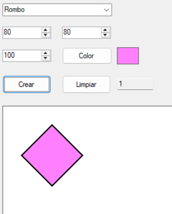
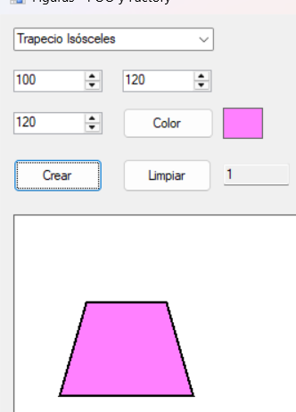
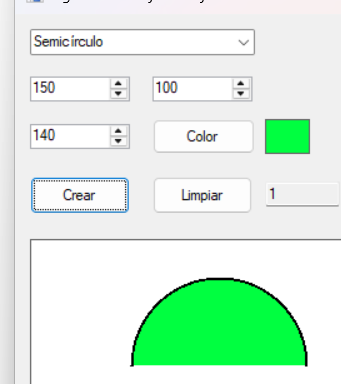
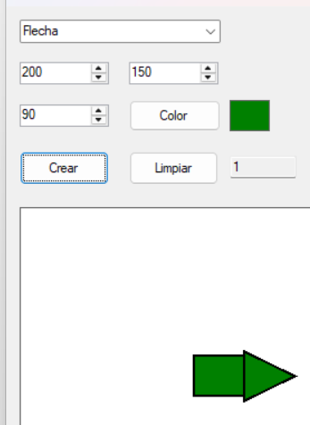
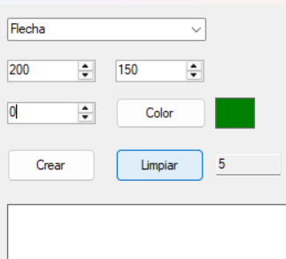
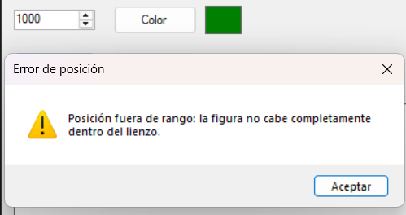
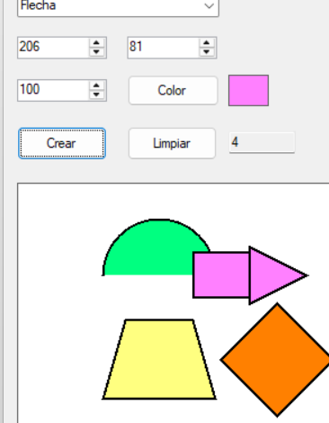
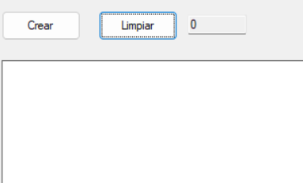

# 🧩 Figuras - Proyecto de Polimorfismo en C# Windows Forms

> Aplicación desarrollada en **C# Windows Forms**, enfocada en aplicar de forma práctica los conceptos de **Programación Orientada a Objetos (POO)** junto con el **Patrón de Diseño Factory**.  
> Permite crear diferentes figuras geométricas dentro de un lienzo, con validaciones y controles visuales intuitivos.

---

## Descripción del Proyecto

Este proyecto muestra cómo implementar los **principios fundamentales de POO** (abstracción, herencia, encapsulamiento y polimorfismo) en un entorno gráfico.  
El usuario puede seleccionar el tipo de figura, su color, tamaño y posición para dibujarla sobre un lienzo interactivo.

El formulario **no crea las figuras directamente con `new`**, sino que utiliza una clase **Factory** que se encarga de la instanciación, cumpliendo así con buenas prácticas de arquitectura.
- No sobra mencionar que tuve que migrar el proyecto, ya que me di cuenta de que el uso de git era clave.
---

##  Características principales

- Interfaz visual amigable desarrollada con **Windows Forms**.  
- Creación de figuras: **Rombo, Trapecio Isósceles, Semicírculo y Flecha**.  
- Validaciones para asegurar que las figuras se dibujen correctamente.  
- Contador dinámico de figuras creadas.  
- Función para limpiar el lienzo.  
- Selección de color mediante `ColorDialog`.  
- Aplicación de todos los pilares de la Programación Orientada a Objetos.  
- Implementación del patrón **Factory** para centralizar la creación de objetos.


---

##  Explicación de las clases

| Archivo | Descripción |
|----------|-------------|
| **Figura.cs** | Clase abstracta base que define propiedades comunes (`X`, `Y`, `Tam`, `Color`) y el método `Draw(Graphics g)`. |
| **Rombo.cs**, **TrapecioIsosceles.cs**, **Semicirculo.cs**, **Flecha.cs** | Clases derivadas que implementan su propio método `Draw()`, cada una con su forma y proporciones específicas. |
| **FiguraFactory.cs** | Aplica el patrón Factory. Crea instancias de las figuras según el tipo seleccionado sin que el formulario use `new`. |
| **Form1.cs** | Controlador principal que maneja los eventos de interfaz, las validaciones y el redibujado del lienzo. |

---

##  Conceptos de POO aplicados

- **Abstracción:** La clase base `Figura` encapsula los atributos esenciales de cualquier figura geométrica.  
- **Encapsulamiento:** Los datos (`X`, `Y`, `Tam`, `Color`) son privados y se accede a ellos mediante propiedades.  
- **Herencia:** Las figuras concretas heredan de `Figura`, reutilizando su estructura básica.  
- **Polimorfismo:** El método `Draw()` se ejecuta de forma distinta según el tipo de figura, usando la misma interfaz base.

---

## 🏭 Patrón Factory

El formulario no instancia figuras directamente.  
Toda creación pasa por la clase `FiguraFactory`, que decide qué tipo de objeto construir según el tipo seleccionado por el usuario.

Ejemplo:
```csharp
Figura figura = FiguraFactory.Create(tipo, x, y, tamaño, color);
```
## Menciones honorificas:
- IA: Me salvo en momentos oscuros (como a la hora de crear la clase y poner bonito el README)
## Capturas de los casos de prueba 

----

-------

-----

----

# No permite dejar el cero

# mensaje a la perfeccion



